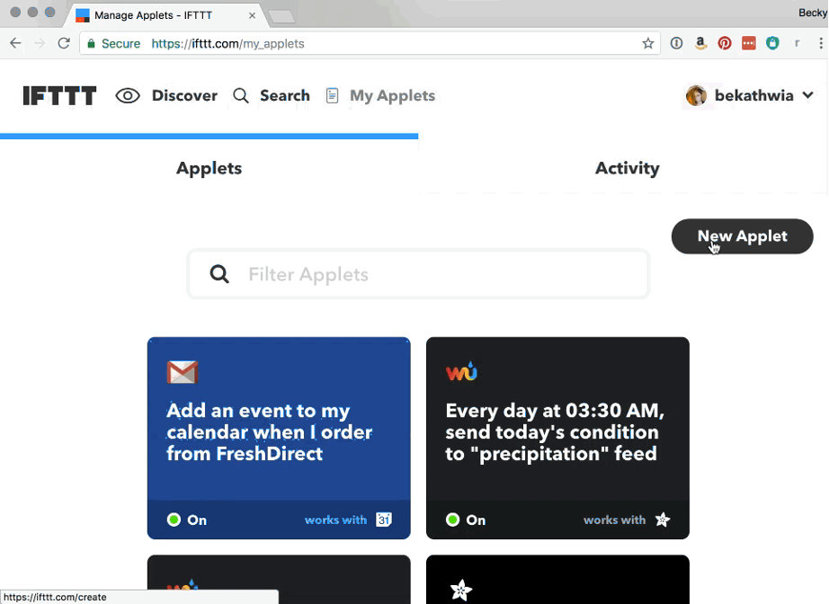

# Self-watering plant

En este proyecto vamos a crear un sistema autómatico de monitoreo que mida de manera regular la humedad del suelo de una planta. En caso de que la humedad del suelo este por debajo de un umbral el sistema activará un sistema de riego. 

## Materiales

* Micrcontrolador ESP32
* Cable USB-micro-USB
* Sensor de humedad resistivo o capacitivo.
* Pantalla Oled.

# Paso 1 - Descarga Arduino IDE e instala los controladores necesarios.
Vísita  la página https://www.arduino.cc/en/software y descarga la versión de Arduino IDE que requieras dependiendo del sistema operativo que estes utilizando. En caso de que decidas usar una computadora Raspberry Pi, elige la versión de **Linux ARM 32-bits**.
## Paso 1b - Instala el controlador de la tarjeta
1. En el menu de archi selecciona **File->Preferences**

1. En el recuadro de **Additional Boad Managers URLs** escribe **https<nolink>://dl.espressif.com/dl/package_esp32_index.json**  y da click en OK.
  

3. Abre el administrador de tarjetas (**Board Manager**). **Tools>Board>Boards Manager**

4. Busca **ESP32** y presional del botón de instalar.

## Paso 2 - Sensor de humedad
A continuación vamos a conectar el sensor de humedad para monitorear el cual nos va a permiitir conocer si es necesario "regar" o no la planta. En este caso vamos a utilizar un sersor capacitivo modelo **Moisture Sensor V1.0**, pero lo puedes sustituir por cualquier otro sensor de humedad. En el siguiente diagrama se muestra una posible conexión. En el repositorio existen dos archivos llamado `sensor.ino` y `sensor_pantalla.ino`. El último de estos permite mostrar los resultados en un pantalla tipo Oled la cual es opcional.

  

En está página encontrarás más información de como utilizarlo. https://wiki.dfrobot.com/Capacitive_Soil_Moisture_Sensor_SKU_SEN0193

**Nota.** En este ejemplo está conectado a la entrada analógica **GPIO34** pero lo puedes conectar al puerto analógico que tu eligas. 

## Paso 3 - Carga y prueba tu programa
En el siguiente video se explica como puedes cargar y probar tu programa. 

## Paso 4 - Servicios en la Nube y conexión WiFi

Los datos de humedad registrados por el sensor serán almacenados de manera remota. Existen varios servicios, por ejemplo,

* <a href="https://cloud.google.com/"> Google cloud. </a>
* <a href="https://www.cloudmqtt.com/"> Cloud MQTT. </a>
* <a href="https://io.adafruit.com"> Adafruit IO. </a>

Para este proyecto vamos a utilizar **<a href="https://io.adafruit.com"> Adafruit IO. </a>** en conjunto con un servicio de monitorea conocido como **<a href="https://ifttt.com"> IFTTT (if this then that) </a>**. 

 
 

Registrate en ambos sitios e instala la aplicación **IFTTT.** Además utilizando el **Administrador de Librerias** de **Arduino IDE**, instala las siguientes librerias. 

*	Adafruit IO
*	ArduinoHttpClient
*	Adafruit MQTT
 
 1. Crea un **Feed** en **Adafruit IO Web**.
 

  
 

 
 2. Haz click en Actions->Create New Feed. Nombralo **Humedad**.
 
 

 
 

 
 3. Busca la llave de activación. Necesitarás añadir esta clave a código posteriormente. Descarga el código que se te proporcionará. Cambia los campos que se te indican, compílalo y cárgalo en tu controlador. 
 
 4. Conecta el **Feed de Adafruit a IFTTTT**. Ingresa a tu cuenta de **IFTTT** y da click en My Applets en la parte superior de la página. Selecciona **New Applet** en la parte derecha de la página y haz click en **+this**. Escribe en el cuadro de búsqueda Adafruit, y selecciona el servicio Monitor a feed on Adafruit IO.

 

 
 

 
5. Llena el menú como se muestra en la figura.  
(**Nota.** Aquí tendrás que seleccionar la condición que consideres más conveniente dependiendo del nivel mínimo de humedad que consideres rasonable.)

 

 
 

6. Da click en +that y elige el servicio que deseas utilizar. Haz click en email o prueba alguno de los otros servicios que te ofrece. Presiona el botón de **Create action**, si lo deseas puedes personalizar el nombre de la **Applet**. Llena los datos que se indican.

 

 
 

 
 Revisa el código ``codigo_muestra.ino``. Este código envía un mensaje cada vez que presionas un botón conectado al **PIN 4**. Incorpora este código con el programa principal ``sensor.ino`` o ``sensor_pantalla.ino``,
